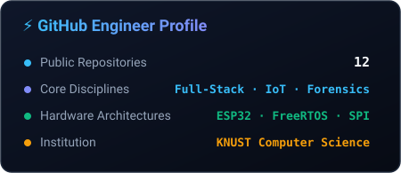
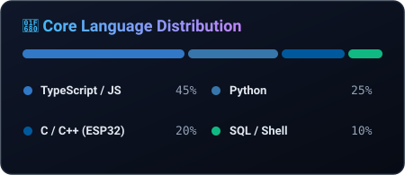

  

  
  
  

---

### About

I build software across an unusually wide range of layers — from typed backends and transactional ledgers to ESP32 firmware and packet forensics.

In a single year, I wrote **ESP32 C/C++ firmware** for an RFID door and attendance system, architected a **peer-to-peer financial escrow engine** with strict zero-balance drift, and designed **deep packet inspection pipelines** for network forensics.

The through-line is that I learn by building the system, stressing it to failure, and understanding the seam where software meets hardware.

---

### Flagship Projects

<table>
  <tr>
    <td width="50%" valign="top">
      <h4>🛡️ VeriTrust — P2P Escrow Engine</h4>
      

        Trust-as-a-Service commerce and dispute arbitration ecosystem removing the standoff between buyers and sellers.
      

      <ul>
        <li><b>Guarded State Machine:</b> Atomic transition gateway with immutable event appending</li>
        <li><b>Partitioned Ledger:</b> Integer pesewas (available, pending-clearance, escrow-locked)</li>
        <li><b>Dual Clients:</b> React 19 web application &amp; Expo SDK React Native mobile app</li>
        <li><b>Payment Engine:</b> HMAC-SHA512 raw-body webhook signature verification</li>
      </ul>
      

        <a href="https://github.com/Veritrust-p2p/p2p"><b>Code Repository →</b></a>&nbsp;&nbsp;|&nbsp;&nbsp;<a href="https://veritrust-p2p.vercel.app"><b>Live Deployment →</b></a>
      

    </td>
    <td width="50%" valign="top">
      <h4>📟 Smart RFID Access &amp; Attendance</h4>
      

        Hardware-to-cloud security platform integrating embedded microcontrollers with a central verification dashboard.
      

      <ul>
        <li><b>Embedded Core:</b> ESP32 SoC communicating with RC522 RFID over high-speed SPI</li>
        <li><b>Firmware Architecture:</b> Non-blocking FreeRTOS tasks with hardware watchdog</li>
        <li><b>Fault Tolerance:</b> Local SPIFFS queue cache ensuring zero scan loss during offline states</li>
        <li><b>Actuation:</b> Optocoupler-isolated relay circuit firing 12V electromagnetic strike locks</li>
      </ul>
      

        <a href="https://github.com/holmes1560/smart-rfid-attendance-system"><b>Firmware &amp; Server Repo →</b></a>&nbsp;&nbsp;|&nbsp;&nbsp;<a href="https://github.com/holmes1560/RFID_Door_lock"><b>Hardware Lock →</b></a>
      

    </td>
  </tr>
  <tr>
    <td width="50%" valign="top">
      <h4>🔍 P-DeepIDS — Packet Forensics</h4>
      

        High-throughput packet dissection and network anomaly detector extracting transport and application layer heuristics.
      

      <ul>
        <li>Live layer 3–7 frame parsing and flow reconstruction</li>
        <li>Feature extraction for malicious behavioral pattern detection</li>
        <li>Exportable pcap analysis and alert dispatching pipeline</li>
      </ul>
      

        <code>Python</code> · <code>Scapy</code> · <code>Wireshark</code> · <code>Network Telemetry</code>
      

    </td>
    <td width="50%" valign="top">
      <h4>🎙️ Voxsynq — Realtime Communications</h4>
      

        Scalable real-time audio, video, and peer-to-peer data platform with resilient signaling and reconnection.
      

      <ul>
        <li>WebRTC media stream negotiation and ICE/STUN/TURN signaling</li>
        <li>Low-overhead signaling protocol over persistent WebSockets</li>
        <li>Optimized client media rendering and bandwidth management</li>
      </ul>
      

        <a href="https://github.com/holmes1560/Voxsynq_Temp"><b>Code Repository →</b></a>
      

    </td>
  </tr>
</table>

---

### Technical Arsenal

| Domain | Technologies |
| :--- | :--- |
| **Languages** | TypeScript, JavaScript, Python, C++, C, SQL, HTML/CSS |
| **Frontend &amp; Mobile** | React 19, Next.js, React Native, Expo, Tailwind CSS, Vite |
| **Backend &amp; Data** | Node.js, Express 5, Prisma 7, PostgreSQL, Redis, Socket.IO |
| **Embedded &amp; Hardware** | ESP32, Arduino, FreeRTOS, SPI / I2C Buses, Relays &amp; Sensors |
| **Tooling &amp; Security** | Docker, Git, GitHub Actions, Linux, Wireshark, Burp Suite |

---

### Activity & Contribution Heatmap

  

<table border="0" width="100%">
  <tr>
    <td align="center" width="50%">
      
    </td>
    <td align="center" width="50%">
      
    </td>
  </tr>
</table>

---

  <i>"The seam between software and hardware is where abstractions stop helping — that's where the real engineering begins."</i>

